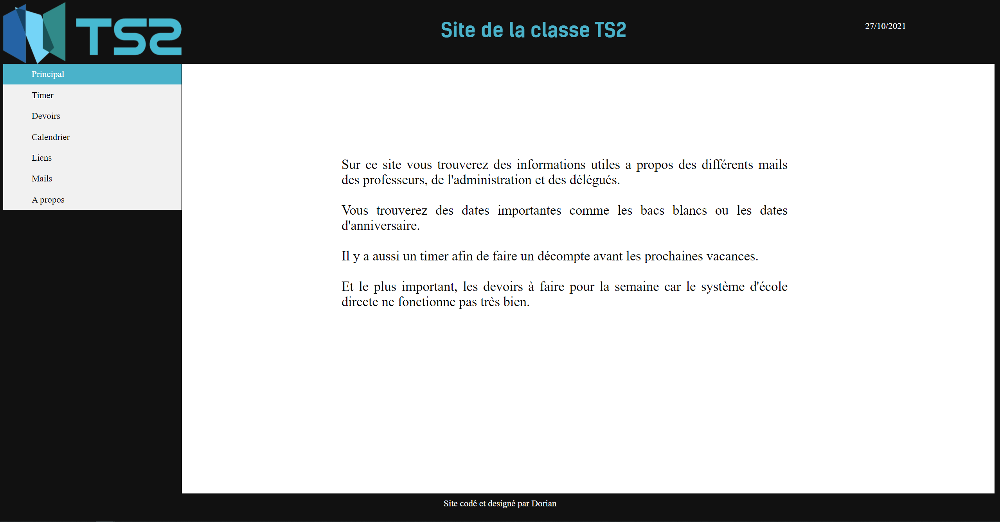

# ClassRoomWebsite
A site used by my class to share homework, usefull e-mail and events

## Functionnality
On this website, you have access to :
 - a timer with the remaining time before the next hollydays
 - a page where you can add or view incomming homeworks
 - links to the usefull websites and ressources
 - our main teacher's e-mail 
 
## How to run the website
You can run it by hosting the website on a IIS server.
Personnally I hosted it on my Raspberry PI with NGINX

For debugging and just to visualize the website I recommend using Microsoft Visual Studio on Windows

